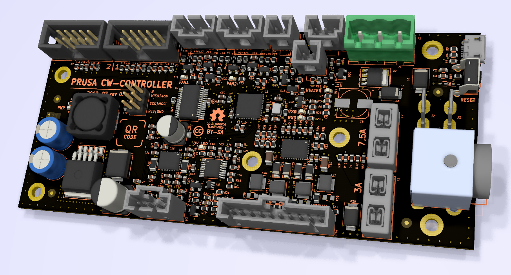

# PRUSA CW controller board

KiCad PCB layout

* [Interactive bom](http://htmlpreview.github.io/?https://github.com/prusa3d/CW-CONTROLLER-PCB/blob/master/rev.04c/ibom.html)
* [STEP 3D model](rev.04c/cw-controller-04c.step)
